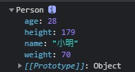

# Object Constructor Function and Prototype Inheritance
我們可以透過 constructor function 來製作大量的 objects

- 用 `function` 的寫法來定義物件的結構，習慣上 `constructor function` 會以開頭大寫命名。
- 用 `new constructor()` 來創造物件

## constructor 的應用
我們要做出很多「人」(constructor)，每個人都有自己的名字、年齡、身高、體重(properties)。

### constructor function
用 constructor function 的方式先創造「人」這個 Constructor，然後用 `new Person()` 來創造「小明」這個物件
- Person 的 property 一定要寫在 function constructor 裡面。
- 用 `new Person()` 創造新的物件「小明」， `this` 指的就是「小明」這個物件。
```js
function Person(name, age, height, weight) {
  this.name = name,
  this.age = age,
  this.height = height,
  this.weight = weight
}

let ming = new Person("小明", 28, 179, 70)

console.log(ming) // Person {name: "小明", age: 28, height: 179, weight: 70}
```




人除了基本資料之外，也可以定義人會「打招呼」(methods)

```js
function Person(name, age, height, weight) {
  this.name = name,
  this.age = age,
  this.height = height,
  this.weight = weight
  this.sayHi = function(){
    console.log(this.name + " says hi.")
  }
}

let ming = new Person("小明", 28, 179, 70)

ming.sayHi() // 小明 says hi.
```

### constructor and prototype

- 把 methods 寫在 constructor function 會產生一個問題。
每次 `new Person`的時候，就會有新的 `sayHi()` 被分配到記憶體裡。
如果做了100次 `new Person()`，就會產生 100 個帶有 `sayHi()` 的物件。
**理想的方式是所有 Person 都去共用一個 `sayHi()`**

- 把 methods 寫在 Person.prototype 來實現：只要是 Person 就能用 `sayHi()`。

```js
function Person(name, age, height, weight) {
  this.name = name,
  this.age = age,
  this.height = height,
  this.weight = weight
}

// 把 sayHi() 加入 Person.prototype
Person.prototype.sayHi = function(){
  console.log(this.name + " says hi.")
}

let ming = new Person("小明", 28, 179, 70)
let hua = new Person("小華", 30, 169, 60)

ming.sayHi() // 小明 says hi.
hua.sayHi() // 小華 says hi.
```

- 以上面的程式碼為例，當我們使用物件裡的 property 或 method 時會發生甚麼事？
1. 呼叫 `ming.sayHi()`
2. 去到 ming 裡找 `sayHi()`，但 ming 沒有 `sayHi()`
3. ming 是一個 Person，去到 Person 的 prototype 找 `sayHi()`，找到了 `sayHi()`
4. 執行 `sayHi()`

- 結論：我們可以把共用的 properties 或 methods 定義在 prototype

## Prototype Inheritance 原型繼承
- JavaScript 幾乎一切都是物件(Object)。
- 所有物件的屬性(properties)及方法(methods)都從 `prototype` 繼承。
- 最上層的 `prototype` 是 `Object.prototype`。

### 如何讓物件去繼承另外一個物件的 properties 及 methods？
當一個物件要繼承其他物件的 properties 及 methods 時，可以用 `Object.create()` 指定要繼承的prototype 。

這裡舉例「人」有不同的「工作者」，而「工作者」仍然有「人」的 property 與 methods。
```js
function Person(name, age, height, weight) {
  this.name = name
  this.age = age
  this.height = height
  this.weight = weight
}

Person.prototype.sayHi = function () {
  console.log(this.name + " says hi.")
}

function Worker(name, age, height, weight, job) {
  // Person.call 是借用 Person 的結構，不代表 constructor 裡面有 Person
  Person.call(this, name, age, height, weight)
  this.job = job
}

// 這一行代表 Worker 的 prototype 是繼承 Person
Worker.prototype = Object.create(Person.prototype)

let ming = new Person("小明", 28, 179, 70)
let hua = new Worker("小華", 30, 169, 60, "老師")

ming.sayHi() // 小明 says hi.
hua.sayHi() // 小華 says hi.
```


---
## 參考

[該來理解 JavaScript 的原型鍊了](https://blog.techbridge.cc/2017/04/22/javascript-prototype/)

[繼承與原型鏈](https://developer.mozilla.org/zh-TW/docs/Web/JavaScript/Inheritance_and_the_prototype_chain)

[物件原型](https://developer.mozilla.org/zh-TW/docs/Learn/JavaScript/Objects/Object_prototypes)

[JavaScript Object Prototypes](https://www.w3schools.com/js/js_object_prototypes.asp)

[[筆記] 談談JavaScript中最單純的原型繼承（prototypal inheritance）─ Object.create](https://pjchender.blogspot.com/2016/06/javascriptprototypal-inheritance.html)