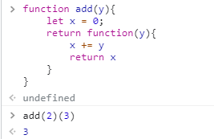
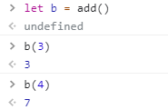
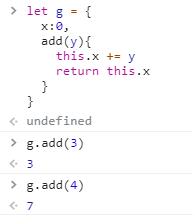

## Scope chain and closure
### 結論
- Scope chain 是指作用域物件(例如function)會組成作用域鍊，例如 function 裡面還有 function的情況，如果取用的變數在自己 function 內找不到，就會持續向外層去找，如果最後都找不到就拋錯誤。
- closure 是作用域物件(例如function)和 function 的組合。

### 原因
scope chain 發生在 function execution context 的 creation phase 創建階段。

在 function execution context 的 execution phase，如果有一個變數不是宣告在 function 裡面，JavaScript會去 "global" 找它。

這裡的 global 是指：
1. function 被分到的記憶體位置(function被定義的地方)
2. function 的外層被分配到的記憶體位置(function被定義的地方外面)，並且持續向外找。

---
### 參考

[閉包](https://developer.mozilla.org/zh-TW/docs/Web/JavaScript/Closures)
[重新介紹JavaScript](https://developer.mozilla.org/zh-TW/docs/Web/JavaScript/A_re-introduction_to_JavaScript#closures)
[function closures](https://www.w3schools.com/js/js_function_closures.asp)
[重新認識 JavaScript: Day 19 閉包 Closure](https://ithelp.ithome.com.tw/articles/10193009)
[所有的函式都是閉包：談 JS 中的作用域與 Closure](https://github.com/aszx87410/blog/issues/35)

### 測試紀錄一下

function add(y) 這裡的y沒用途，是我寫錯了XDD


因為 function也是一個object
把這個object用b存起來，那b就會看起來是

```js
let b = {
  x : 0 ,
  function(y){
    x = x + y;
    return x }
  }
```

執行b(3) =>
```js
{
    x : 3 ,
    function(3){
      x = 0 + 3;
      return x
    }
  }
```

再執行b(4) =>
```js
{
    x : 7 ,
    function(4){
      x = 3 + 4;
      return x
    }
  }
```


做一個object來看看結果