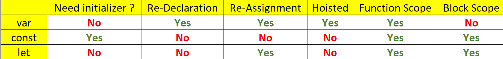

## Global Execution Context 全域執行環境

執行JS程式之前會做甚麼事情？

1. Creation Phase 創建階段
- window object被創造出來
- scope chain 被創造出來
- `this`被創造出來 (指向window object)
- Hoisting

2. Execution Phase 執行階段
一行一行的跑程式碼。跑程式碼的原則是 callstack.

## Function Execution Context 函式執行環境

function在執行之前會做甚麼事情？

1. Creation Phase 創建階段
- scope chain 被創造出來
- `this`被創造出來(如果 function 不是 arrow function的話)
- Hoisting

2. Execution Phase 執行階段
一行一行的跑程式碼。跑程式碼的原則是 callstack.

## Hoisting
### 結論
- 在 var 變數還沒被 assignment 的時候就被使用了，會得到undefined
- 在執行function declaration之前就呼叫function了，會正常執行function
- let 和 const 以及 function expression 不會有上述 hoisting 的結果

### 原因
Hoisting 發生在 execution context 的 creation phase 創建階段。

memories get allocated to all the functions declaration variable and var variables, not for the let and const and function expression. 記憶體會分配給 function的宣告 還有 var變數的宣告，但不會分配給 let 和 const (lexical declaration) 以及 function expression

Hoisting 指的是由於 functions declaration variable 及 var variables 在 creation phase 時被分配到記憶體當中，所以在 Execution Phase 時就可以在宣告之前使用。

```js 補充functions declaration 及 function expression
// function declaration 函式宣告
function sayHi1(){
  console.log("hi")
};
// function expression 函式表達式
const sayHi2 = function(){
  console.log("hi")
}
```


### 複習let, const, var
initializer 初始化變數的值
- const 必須初始化
- var, let 不用

re-declaration 重複宣告
- var 可以
- let, const 不可以

re-assignment 重新賦值
- var, let 可以
- const 不可以

## Scope in JS
scope (n.) 範圍

- 它會決定變數的accessibility(visibility)，也就是說Scope是決定你的程式碼在哪個範圍是有意義的。
- JS有三種scope
1. Global Scope
2. Function Scope
3. Block Scope

### Global Scope (var, let, const)
在JS裡面，宣告在最外層的地方都是有意義的(可以訪問的)。
```js
let myName = 'Bolas'

function sayHi() {
  console.log(myName + " says good morning.")
}
```
### Function Scope (var, let, const)
if a variable has function scope, then it can only be seen inside the function.
it has no meaning outside the function.

如果變數有function scope，它在function內才能被看到(可以訪問)。
它如果在function外就沒有意義。

### Block Scope (let, const)
a variable that has block scope means
it can only be seen inside a loop or a if statement

變數有block scope表示
它在loop或if語法裡面才能被看到(可以訪問)。

### var variable in for loop
用 loop 時如果用同名的var變數，就會被loop改變值。

這是因為 var 沒有 block scope，所以不管在任何地方都能被看到(可以訪問)。

也就是為什麼開發上盡量不使用var變數。

```js
var x = 1

for(var x = 0; x < 10; x++) {
  console.log(x)
}

console.log(x) // 10
```

### 小抄


## Scope chain and closure

in function execution context, if they find a variable that was "not declared inside the function", JavaScript will go to the "global" variables and find.

global means
1. where the memory was allocated to the function.
2. a lower level function of the call stack where the memory was allocated to, and keep searching down.

scope chaining 在 execution context 的 creation phase 會發生的事情

Scope chain 是指 作用域物件(例如function)會組成作用域鍊，例如function裡面還有function的情況，如果取用的變數在自己function內找不到，就會向外層去找。

closure 是作用域物件和function的組合。

[閉包](https://developer.mozilla.org/zh-TW/docs/Web/JavaScript/Closures)
[重新介紹JavaScript](https://developer.mozilla.org/zh-TW/docs/Web/JavaScript/A_re-introduction_to_JavaScript#closures)
[function closures](https://www.w3schools.com/js/js_function_closures.asp)
[重新認識 JavaScript: Day 19 閉包 Closure](https://ithelp.ithome.com.tw/articles/10193009)
