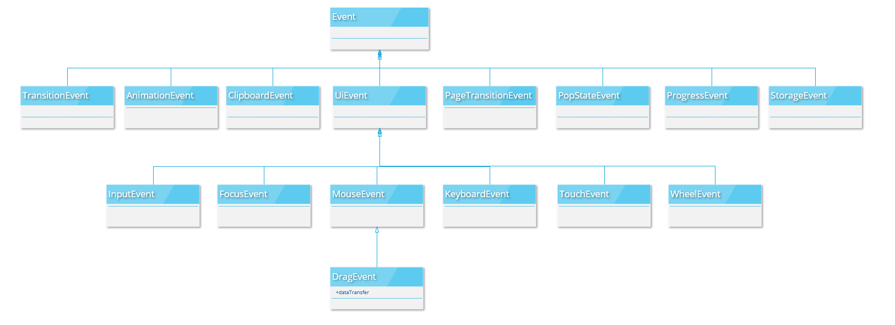

# DOM
Document Object Model 文件物件模型
## Why do we learn DOM? 為什麼我們要學DOM?
DOM能夠讓我們操作HTML的標籤

## window Object
window代表瀏覽器的視窗，也就是JavaScript運行的地方，當你打開瀏覽器(例如Chrome, Firefox, Edge)的時候它就存在了。

window object是一個瀏覽器已經定義好的全域變數，有自己的methods和properties。

## 常用的window object methods
* alert()
* prompt()
* addEventListener()
* clearInterval()
* setInterval()

## 常用的window object properties
* console
* Document
* LocalStorage
* SessionStorage

更多可以看 [W3school - Window Object](https://www.w3schools.com/jsref/obj_window.asp)

# What exactly is DOM

* Document 是一個 Object，也是window object的其中一個屬性。
* Document 的意思是 HTMLDocument
* Model是指HTML元素都是物件，代表HTML元素都有自己的properties 和 methods

## document Object Model

在 JavaScript 裡面，想要控制 HTML elements 的話，我們可以操作 DOM 來實現，因為每個 html element 都是一個物件，裡面已經有可以用的 properties 跟 methods。

### Document Object
Document 是 window Object 裡面的其中一個property

#### methods

- addEventListener()
- createElement()
- getElementById()
- getElementsByClassName()
- querySelector()
- querySelectorAll()

NodeList 很像 Array，但它不是 Array。
如果是 Array 的話，它會有 Array 的方法，例如 pop()

---

<!-- 下面這一段是在講function -->

## Arrow Function Expression

function declaration

```js
function sayHi() {
  console.log('Hi!')
}
```

arrow function expression

```js
const sayHi = () => {
  console.log('Hi!')
}
```

### Hoisting

function 在宣告之前使用，會有 Hoisting

```js
sayHi() // Hi!

function sayHi() {
  console.log('Hi!')
}
```

function 在建立之前使用，會報錯

```js
sayHi() // Uncaught ReferenceError: Cannot access 'sayHi' before initialization

const sayHi = () => {
  console.log('Hi!')
}
```

### this keyword

- "this" means "this object" in function declaration
- "this" means "window object" in arrow function expression
  建議在 Object 裡面的 function 都用 function declaration，這樣才取得到 object 本身的資料。
  使用 Vue 的話會透過 arrow function 搭配 this 來取得 Vue 裡面的資料。

```js
let Apple = {
  name: 'Good apple',
  price: 30,
  // function declaration
  sayPrice() {
    console.log(this.price)
  },
  // arrow function expression
  howMuch: () => {
    // this.price not is Fruit.price, cause this in arrow function
    console.log(this.price)
  },
}

Apple.sayPrice() // 30
Apple.howMuch() // undefined
```


## forEach function
為每一個元素做事。
- forEach is an array property
- forEach function takes one parameter - function (forEach 要傳入帶一個參數的 function)
- the parameter of forEach function is called "CallBack" function (這個傳入的參數叫做 CallBack function)
#### syntax
- 基本語法
```js
let numbers = [7, 13, 25, 36, 47, 5, 88, 49]

function checkNum(n){
  if(n >20) {
    console.log(n)
  }
}

numbers.forEach(checkNum)
```

- loop through an array has two ways, for loop and forEach function (兩種方式去 loop Array, for loop 跟 forEach function)
兩者都可以用，但實務上用forEach居多，forEach可以一眼就看出來是在對numbers這個陣列做事，for loop的話還要花更多時間理解。
```js
let numbers = [7, 13, 25, 36, 47, 5, 88, 49]

// forEach
numbers.forEach(function checkNum(n){
  if(n >20) {
    console.log(n)
  }
})

// for loop
for(let i = 0;i<numbers.length;i++){
  if(numbers[i] > 20) {
    console.log(numbers[i])
  }
}

```

- anonymous function 匿名函式
是指沒有function Name的function，在forEach()裡的function就是一個匿名函式。
  - anonymous function is a type of function declaration (它也是一種 function declaration)
```js
let numbers = [7, 13, 25, 36, 47, 5, 88, 49]

// forEach
numbers.forEach(function(n){
  if(n >20) {
    console.log(n)
  }
})
```

- arrow function expression
```js
let numbers = [7, 13, 25, 36, 47, 5, 88, 49]

// forEach
numbers.forEach((n)=>{
  if(n > 20){
    console.log(n)
  }
})
```

#### parameter
在callback function 裡面要帶的參數
- currentValue 當前的值
- index 索引(可不用)
- array 陣列(可不用)

---
## Array, HTMLCollection and NodeList
- 這三個很相似(都有length跟index)
- HTMLCollection, NodeList
  - 都有 length 這個 property
  - 都有 indices (index的複數)
```js
// array
let numbers = [4,62,30,24]

// HTMLCollection
let containerElements = document.getElementByClassName('container')

// NodeList
let containerSelector = document.querySelectorAll(".container")
```

- array, NodeList可以用forEach()，但HTMLCollection不行
開發上偏好使用`querySelectorAll()`，因為會回傳NodeList，它可以用forEach()；getElementByXX()回傳的是HTMLCollection

---
## Element Object
這裡指的是HTML Element
1. 不同的HTML element "可能" 有它自己的方法(methods)跟屬性(properties)，例如`<video>`、`<p>`
2. 所有的HTML element一定會有的properties跟methods 如下
  - addEventListener()
  - appendChild()
  - children
  - childNode
  - classList(add(), remove(), toggle(), contains())
  - getAttribute()
  - innerHTML, innerText
  - parentElement()
  - querySelector()
  - querySelectorAll()
  - remove()

### children and childNode Property
* children returns HTMLCollection
* childNode returns NodeList

### parentElement
* parentElement returns HTMLElement

### innerHTML, innerText
功能上類似，唯一的不同是在於，innerHTML裡面如果含有HTML tag的字串，就會被當作HTML來閱讀，而innerText無論輸入什麼內容，都是當成文字來閱讀。
```html
<!-- 原本沒有內容 -->
<h1 class="myh1"></h1>
```
```js
let h1 = document.querySelector("h1.myh1");
// 畫面顯示為 <mark>Hey apple.</mark>
h1.innerText = "<mark>Hey apple.</mark>";

// 畫面顯示為黃底的 Hey apple.
h1.innerHTML = "<mark>Hey apple.</mark>";
```

### appendChild()
新增一個HTML Element到指定的HTML Element裡面
```html
<!-- 原本為空的 -->
<body></body>
```
```js
// 在body裡面放入一個h1標籤
let body = document.querySelector("body");

let myh1 = document.createElement("h1");
myh1.innerText = "Hey apple";

body.appendChild(myh1)
```

### classList
- 是一個object，有自己的methods跟properties(add(), remove(), toggle(), contains())
- 它會把HTML Element裡面的class全部回傳回來。

### getAttribute()
- 可以找到HTML Element已設定的屬性。
```html
<a href="http://google.com">google</a>
```

```js
let a = document.querySelector("a")

console.log(a.getAttribute("href")) // http://google.com
```

### querySelector() and querySelectorAll()
除了Document object有這兩個methods，只要是HTML Element也都有這兩個可以使用。
```html
<section>
  <p class="red">
    Lorem, ipsum dolor sit amet consectetur adipisicing elit. Obcaecati officiis sit non voluptates beatae iste nobis animi sint delectus, vel asperiores cum aut voluptas, id nostrum doloremque, vitae magnam porro.
  </p>
  <p class="red">
    Lorem, ipsum dolor sit amet consectetur adipisicing elit. Obcaecati officiis sit non voluptates
  </p>
</section>
<p class="red">
  cum aut voluptas, id nostrum doloremque, vitae magnam porro.
</p>
```
```js
// document.querySelectorAll()
let redP = document.querySelectorAll("p.red")
console.log(redP) // 所有的p


let section = document.querySelector("section")
// Element object querySelectorAll()
let sectionRedP = section.querySelectorAll("p.red")
console.log(sectionRedP) // 只有section裡面的p
```

### remove()
移除指定的HTML Element
```js
let h1 = document.querySelector("h1")
h1.remove()
```

---
## Concept Inheritance
### What is "Inheritance" 解釋繼承的概念
人是一個object
有name、age這些 properties
也有eat()、walk()這些 methods

鋼鐵人、雷神索爾都是人
所以也有name、age、eat()、walk()
cause properties and methods inherit from 人

除了是人之外，它們還有自己的能力
例如鋼鐵人有fly() 、雷神索爾有 raise()

### Inheritance in DOM
- All HTML elements inherit properties and methods from "element object." (大部分的HTML element都繼承自element object，例如：h1-h6, video, form)
- But some of them have its own methods. (而且有些還有自己定義的methods，例如：video有play(),pause())

---

## JS Events introduction
瀏覽器有一些事情發生的時候，JS Event就會occurred(發生)，例如 resize the screen, click on a button, press a key on keyboard

- JS Events 發生時，需要event listener
event listener才知道JS Event的細節

### addEventListener(event type, callback)
- window object and element object can used `addEventListener()`
- `event type` example: resize the screen, scroll, click
- `callback` function - have a parameter is `event`
- `JS Event` type is object
```js
// event type is "click"
// callback function is "e => {...}" and "e" is click event
window.addEventListener("click", e=>{
  console.log(e)
})
```

### Event Object Inheritance
All event objects are based on Event Object, and inherit all of their properties and methods (所有event object都是基於Event Object，並且繼承了他的properties跟methods)


### Event Object Methods and Properties
- target
- preventDefault()

#### target
return a element object

#### preventDefault()
防止預設事件發生。

---
## Style Object
- is a property of element object. 是element object的屬性
- is an object that is controlling the CSS styling of an HTML element. 本身是個物件，用來控制HTML element的CSS樣式
- hyphen in JS is not allowed, therefore, CSS properties in JS are changed to camelCase 原本在CSS的屬性如果是用-串起來的，在JS裡面要改成駝峰式，例如background-color要寫成backgroundColor
- 設定style object相當於設定element的inline style，所以會蓋過其他的style設定方式
```html
<button>按鈕</button>
```
```js
// 改變按鈕的樣式
let button = document.querySelector("button");
// 改變properties的寫法
button.style.backgroundColor = "black";
button.style.color = "white";

// 給字串的寫法
button.style = "background-color:black; color: white;"

// 把inline styling清空
button.style = ""
```

### Dynamic Header

---
## Event Bubbling 事件冒泡
### what is event bubbling?
泡泡會一層層往上走(bubble up)，觸發的事件也會一層層往上走。
當你的網站的event listener越多，越要小心event bubbling，可能會觸發不該發生的事件。

下列範例，如果點擊到b的範圍內，b的父層a也會被觸發。
```html
<div class="a">
  <div class="b"></div>
</div>

<script>
  let a = document.querySelector('div.a')
  let b = document.querySelector('div.b')

  a.addEventListener('click', ()=>{
    console.log("a's event listener's callback is running.")
  })
  b.addEventListener('click', ()=>{
    console.log("b's event listener's callback is running.")
  })
</script>
```
### How to stop event bubbling?
* stopPropagation()
is an event object's methods
Propagation 擴散

```html
<div class="a">
  <div class="b"></div>
</div>

<script>
  let a = document.querySelector('div.a')
  let b = document.querySelector('div.b')

  a.addEventListener('click', ()=>{
    console.log("a's event listener's callback is running.")
  })
  b.addEventListener('click', e => {
    // 寫在要停止擴散的地方
    e.stopPropagation();
    console.log("b's event listener's callback is running.")
  })
</script>
```

---

## Local Storage and Session Storage
LocalStorage and Session Storage is Window Object Properties

- Storage is a place to store data in "browser".(This is not database)

- key value pair. (Both must be string. If the value is not string, then it would be cast to string.)
pair是一對的意思。把資料用key value pair 來儲存，我們用key，就能找到value。例如name是key， 小明是value，我們就會這樣存{"name": "小明"}

### Storage methods
key 不能重複
- setItem(key,value)
- getItem(key)
- removeItem(key)
- clear()

在chrome裡面按F12，Application>Storage，可以找到Storage存的資料。

### Difference between local and session
瀏覽器關掉的時候Session Storage會被清空。Local Storage 的資料則是沒有期限的，如果沒清掉的話，就會一直存在。

### String storage
Storage can only store string. 只能存 string 這種data type，如果存的不是string，也會轉型存成string

### How to store other types of data?
用JSON的方式來存，可以把物件轉型為string來存，取的時候可以轉回正確的資料類型。

JSON means JavaScript Object Notation
- JSON.Stringify()
- JSON.parse()

```js
let friends = ["Josh","Mike","Doug"]

// 存
localStorage.setItem("friends", JSON.Stringify(friends))

// 取
let friends = JSON.parse(localStorage.getItem("friends"))
```

---

## why do we put script tag at the bottom? 為什麼我們要把`<script>`放到最下面

- JS的程式碼會需要花比較多的時間才render出來，所以我們先讓html跟css先跑完，最後再來處理js。
- 必須先讓瀏覽器讀取全部的HTML跟CSS，你才可以使用DOM
